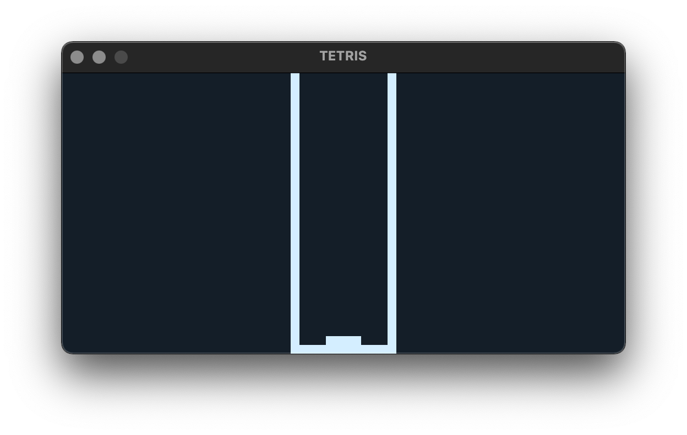
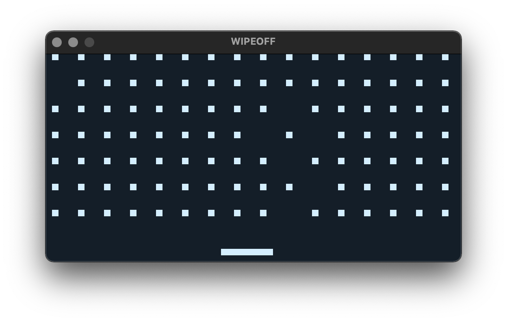
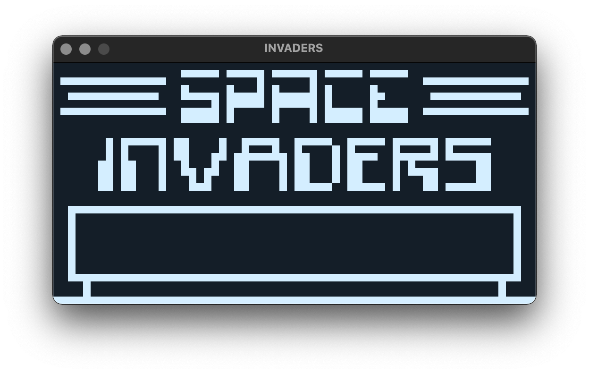
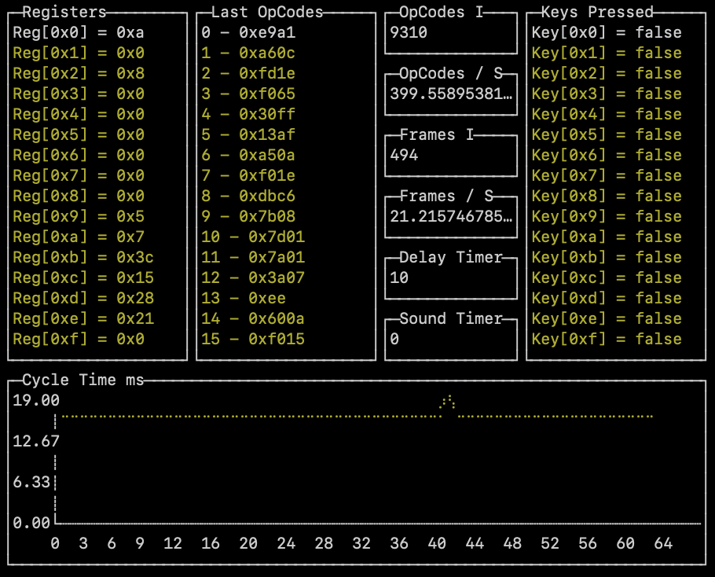

# Chip-8 Interpreter

## Usage

```
  -debug
    	debug output
  -delay int
    	extra delay between each cpu cycle in milliseconds
  -dump
    	dump the rom contents
  -file string
    	enter a relative file path to load
  -scale int
    	scale each display pixel (default 4)
  -sound bool
    	enable sound with true, false by default (TODO: not implemented)
```

## Example First Command

Find a Chip-8 rom file (not included, try searching for `test_opcode.ch8`, `chip8-test-rom.ch8`, and `IBM Logo.ch8`) then run:

```
go run cmd/chip8/main.go -file "./relative/path/to/file.ch8"
```

## Key Bindings

The default key bindings for the 16 Chip-8 keys are:

```
 ---------------
| 1 | 2 | 3 | 4 |
|---|---|---|---|
| q | w | e | r |
|---|---|---|---|
| a | s | d | f |
|---|---|---|---|
| z | x | c | v |
 ---------------
```

Modify `components/keyboard.go` to change these bindings.

Scale screen/window in realtime (buggy) with keys:
```
 -------
| - | + |
 -------
```

## Sreenshots


### Tetris
<p align="left"> </p>

### Wipeoff
<p align="left"> </p>

### Invaders
<p align="left"> </p>

### Debug Mode
<p align="left"> </p>

## TODOs

* Implement sound
* Fix y-coordinate wrapping
* Fix graphical flicker. Flicker is inherent to chip8 rendering but could be mitigated.
* Fix input timing (key needs to be held down at the time the relevant op codes execute, feels sluggish, needs keyup delay)
* Fix cycle and opcode timing, it's incredibly bad, frametime graph is all over the place.
* Fix display rendering implementation, incredibly slow and is mostly responsible for the bad frametimes.
